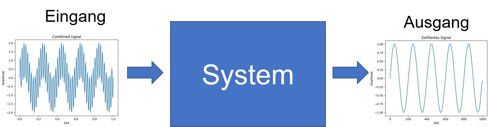
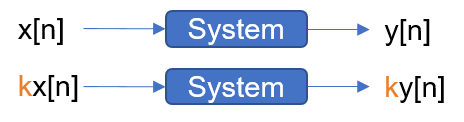
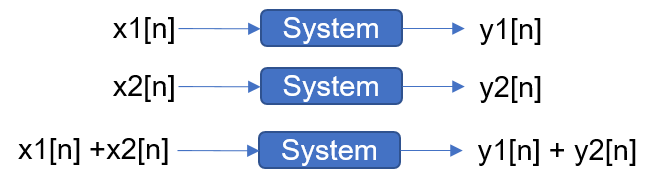
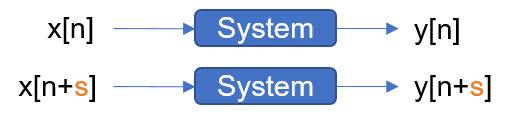
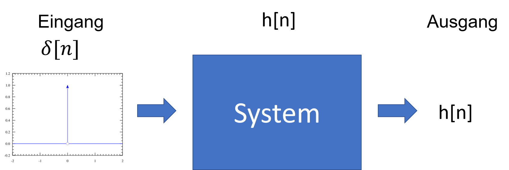

## System und Impulsantwort
## Was ist ein System?

Ein System ist ein Prozess, der ein Ausgangssignal als Antwort auf ein Eingangssignal produziert.



Ein Signal beschreibt wie ein Parameter sich auf einen anderen bezieht:

Weg <- -> Zeit  

Nomenklatur:
- Kontinuierliche Signale:		x(t), y(t)
- Diskrete Signale:		    	x[n], y[n]
- Zeitbereich: 			        x(..)
- Frequenzbereich:		        X(..)


## Systemeigenschaften

Auf den ersten Blick mag es wie eine überwältigende Aufgabe erscheinen, alle möglichen Systeme in der Welt zu verstehen. Glücklicherweise fallen die meisten nützlichen Systeme in eine Kategorie, die als lineare Systeme bezeichnet wird.

Die meisten Techniken der digitalen Signalverarbeitung (DSP) basieren auf einer Strategie des „Teile-und-herrsche“-Prinzips, die als Superposition bekannt ist. Dabei wird das zu verarbeitende Signal in einfache Komponenten zerlegt, jede Komponente wird einzeln verarbeitet, und die Ergebnisse werden anschließend wieder zusammengeführt.

Dieser Ansatz hat die enorme Stärke, ein einziges kompliziertes Problem in viele einfache Teilprobleme zu zerlegen. Die Superposition kann jedoch nur bei linearen Systemen angewendet werden – ein Begriff, der bedeutet, dass bestimmte mathematische Regeln gelten. Glücklicherweise gehören die meisten Anwendungen, die in Wissenschaft und Technik auftreten, zu dieser Kategorie. ([[1]](#1))

**Linearität**, **Zeitinvarianz**, **Kausalität** und **Stabilität** sind grundlegende Eigenschaften, mit denen Systeme beschrieben und analysiert werden können. Sie helfen zu verstehen, wie ein System auf verschiedene Eingaben reagiert und ob es sich vorhersagbar verhält.

### Linearität
Ein System ist **linear**, wenn es die Eigenschaften der **Homogenität** (Skalierung) und **Additivität** (Superposition) erfüllt:
- **Homogenität**:



- **Additivität**:



**Superpositionsprinzip**: Ein System, das sowohl additiv als auch homogen ist, wird als linear bezeichnet und unterliegt dem Superpositionsprinzip. 
Die Antwort eines linearen Systems zur Summe aus mehreren Signale ist gleich die Summe der einzelnen Antworten  


### Verschiebungsinvarianz
Ein System ist **verschiebungsinvarianz**, wenn eine Verschiebung des Eingangssignals zu einer gleich verschobenen Ausgabe führt.  


### Kausalität
Ein System ist **kausal**, wenn der aktuelle Ausgang nur von gegenwärtigen und vergangenen Eingaben abhängt — niemals von zukünftigen Werten.


**📝 Aufgabe 1: Test auf Linearität**

Testen Sie, ob das System linear ist, basierend auf dem Superpositionsprinzip.


```python
# Setup: Install required libraries
import numpy as np
import matplotlib.pyplot as plt
```


```python
def system(x):
    y = np.zeros_like(x)
    for n in range(1, len(x)):
        y[n] = x[n] + 2*x[n-1]
    return y
```


```python
# Create two signals
x1 = np.random.rand(100)
x2 = np.random.rand(100)
a, b = 2, -1

lhs = 
rhs = 

print("Linear?", )
```

**📝  Aufgabe 2: Test auf Zeitinvarianz**

Verzögern Sie den Eingang und prüfen Sie, ob die Ausgangsverzögerung übereinstimmt.

**📝 Aufgabe 3: Kausalität**

Hängt der Systemausgang nur von aktuellen/vergangenen Eingängen ab?

## Delta-Funktion (Dirac-Impuls)
Die Delta-Funktion ist ein grundlegendes Konzept in der Signalverarbeitung und Systemtheorie. Die Deltafunktion ist die normalisierte Impulsantwort, wobei der Wert (bei x=0) gleich 1 ist und alle anderen Werte gleich 0 sind. In diskreten Systemen ist sie definiert als:

$$ \delta[n] = \begin{cases} 1, & n = 0 \\ 0, & \text{otherwise} \end{cases} $$

Einer Deltafunktion, welche durch ein System geführt wird. Die Impulsantwort ist dabei der Output. 




- Impulsantwort ist das Signal welches als Ausgangssignal erzeugt wird, wenn die Deltafunktion dem System als Input gegeben wird ℎ[𝑛]
- Beim digitalen Filterdesign wird Impulsantwort auch Filter Kernel, Faltungskernel oder Kernel genannt (auch relevant in der Bildverarbeitung)


```python
# Discrete time samples from -2 to 2
t = np.arange(-4, 5)  # [-2, -1, 0, 1, 2]

# Create discrete delta (impulse) function
delta = np.zeros_like(t)
delta[t == 0] = 1  # Impulse at n = 0

# Plot
plt.stem(t, delta)
plt.title("Discrete Dirac Delta Function δ[n]")
plt.xlabel("n")
plt.ylabel("δ[n]")
plt.grid(True)
plt.show()
```

## Impulsantwort
Die Antwort eines Systems auf einen Delta-Eingang δ[n] definiert dessen Impulsantwort h[n].


```python
# Simple system: y[n] = x[n] - 0.5 * x[n-1] - 0.2 * x[n-2] - 0.1 * x[n-3]
def lti_system(x):
    y = np.zeros_like(x, dtype=float)
    for n in range(len(x)):
        if n >= 0:
            y[n] += x[n]
        if n >= 1:
            y[n] += -0.5 * x[n-1]
        if n >= 2:
            y[n] += -0.2 * x[n-2]
        if n >= 3:
            y[n] += -0.1 * x[n-3]
    return y

impulsantwort = lti_system(delta)

plt.stem(t, impulsantwort)
plt.title("Impulsantwort LTI System")
plt.xlabel("t")
plt.ylabel("h[t]")
plt.grid(True)
plt.show()
```

## Systemantwort

**📝 Aufgabe 4:** 

Verwenden Sie die Faltung, um den Systemausgang für einen bekannten Eingang und eine Impulsantwort zu berechnen.


```python
# Calculate the system response using convolution
```

**📝 Aufgabe 5:**
Verändern Sie die Eingangsform oder die Impulsantwort. Wie wirkt sich das auf den Ausgang aus?

**Quellen und Weiterführende Literatur:**

<a id="1">[1]</a> Smith, Steven W. (1997), The scientist and engineer's guide to digital signal processing. 1. ed. San Diego, Calif.: California Technical Publ. Online verfügbar unter https://www.dspguide.com/.
